# **Multiplex, Multilife! \[멀티플렉스, 멀티라이프!\]**

안녕하세요! 데잇걸즈의 F조 멀.플.입니다. 멀.플.은 멀티플렉스를 분석하는 멀티플레이어들이라는 뜻이랍니다. 멀.플.조는 여가시간에 놀 곳을 고민하는 여러분들을 위해 복합쇼핑몰을 데이터 분석으로 알아보았어요. 그 내용을 함께 확인해볼까요?

## **Part 1. 멀티플렉스, 어디까지 가봤니?**
저희는 10개의 복합쇼핑몰을 대상으로 분석을 진행했습니다. 복합쇼핑몰들을 데이터로 알아볼게요.

### **인스타그램 태그량으로 보는 쇼핑몰**

분석에 들어간 10개의 쇼핑몰은 소개합니다! **인스타 태그량** 과 함께 지도에 나타냈습니다.
**핫한 복합쇼핑몰** 은 어디일까요?


[소스코드 보기 - by 채송이](https://github.com/Yoonkimove/multiplex/blob/master/M3_visualize_insta_multi.ipynb)

분석에 들어간 10개의 쇼핑몰은

- 스타필드 하남
- 스타필드 코엑스
- 테크노마트 강변
- 아이파크몰 용산
- 가든파이브
- 타임스퀘어
- 디큐브시티
- 롯데몰 김포
- 롯데몰 은평
- IFC몰

입니다!

### **입점 상점 분포**

10개의 멀티플렉스에 어떤 가게 분류들이 있는지 보겠습니다!
저희는 모든 멀티플렉스 안의 상점들을 4개의 label로 분류해보았어요. 차트별로 다른 정보를 얻을 수 있는데요, 3개의 차트를 보여드릴게요.

**카테고리를 기준으로 전체 상점 비율을 알아볼게요.**

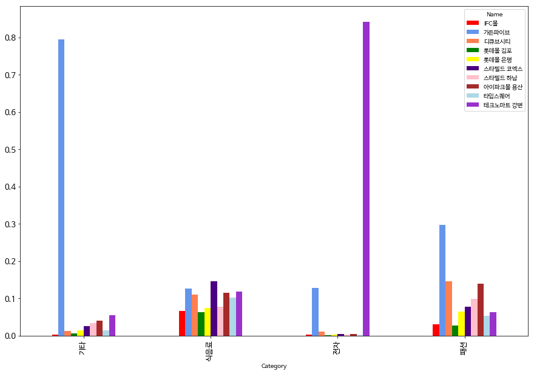

- 테크노마트의 전자기기 매장의 개수가 엄청나죠? 엄청난 **비중 차이** 와 함께 튀는 데이터들을 더 많이 볼 수 있어요.
- 음식점과 패션은 다들 비슷비슷하네요.

**100% 기준 누적 가로 막대형 차트입니다.**
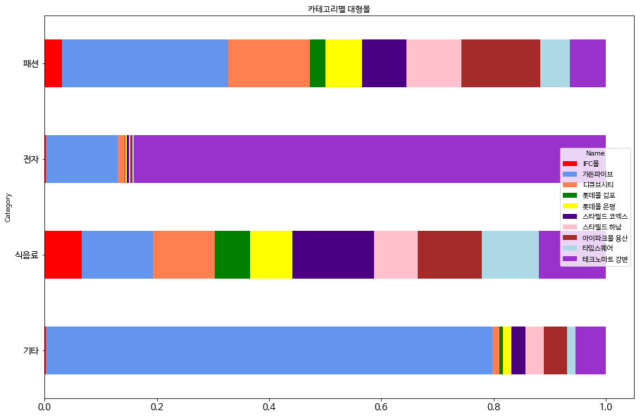

- 위와 같은 데이터지만 전체 대비 비율을 좀 더 눈여겨 볼 수 있어요.

**멀티플렉스 별 비중은 어떤지 볼까요?**
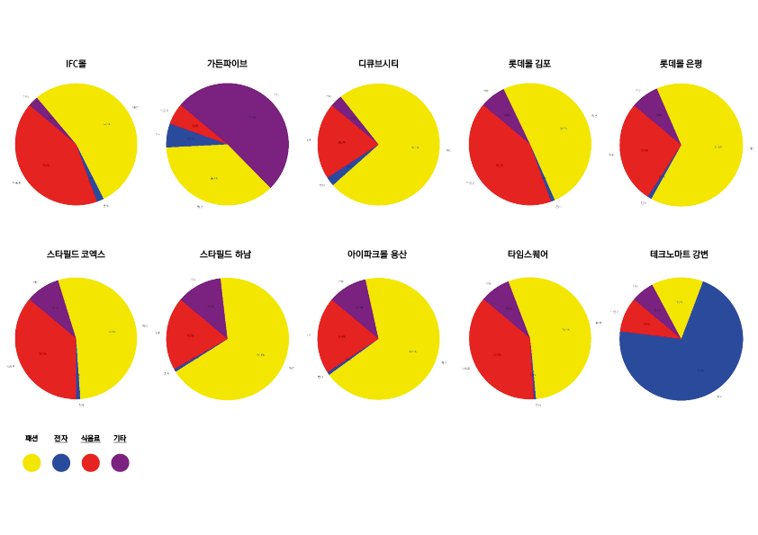

- 대부분 패션이 많은 편이네요.

[소스코드 보기 - by 채송이, 김진영](https://github.com/Yoonkimove/multiplex/blob/master/shopping_category_frequncy.ipynb)

## **Part 2. 멀티플렉스 선택장애에 걸렸어요! 도와주세요!**
고민을 제공해준 사람들의 입맛에 맞는 멀티플렉스를 찾아볼까요?

### **J양의 고민**

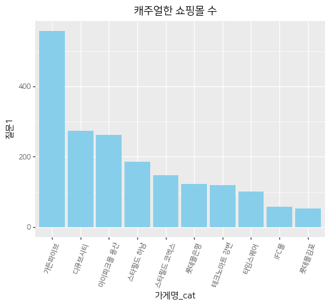

### **S양의 사연**

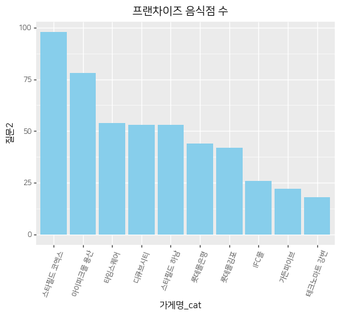

### **Y양의 생각**

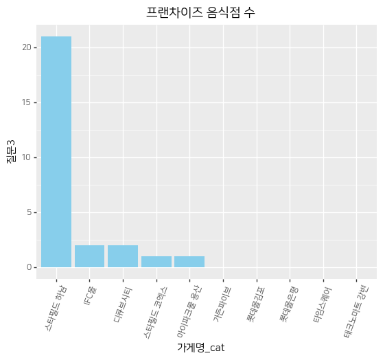

[소스코드 보기 - by 김지은](https://github.com/Yoonkimove/multiplex/blob/master/M3_visualize_data_chart.ipynb)

## **Part 3. Quiz Quiz**
요즘 각각 복합쇼핑몰들은 뭘로 유명할까요? 연관검색어를 안볼 순 없겠죠?

### **Q1. 이곳은 어디일까요? (Hint : 면세점)**
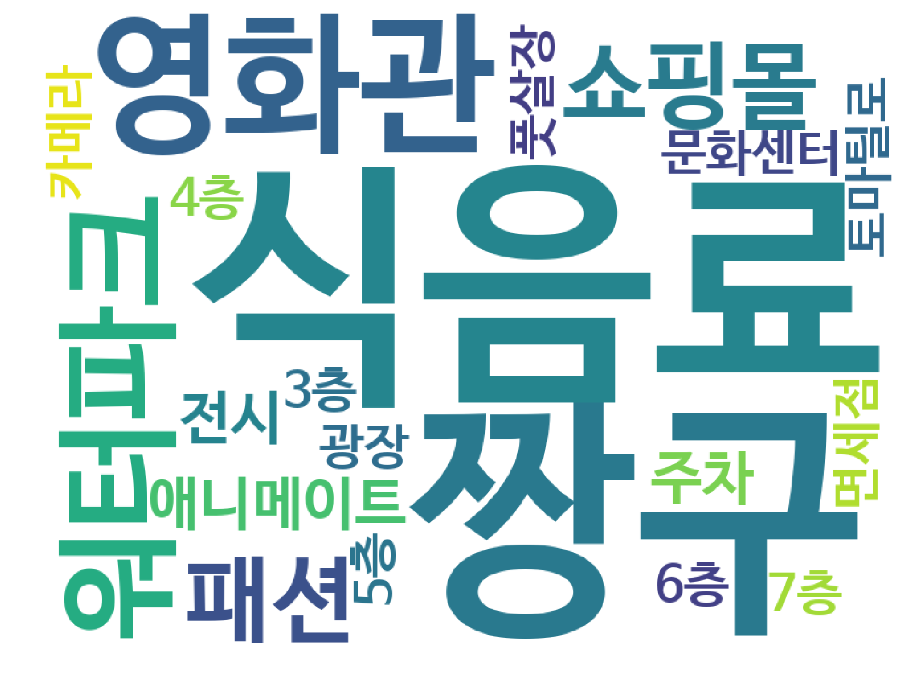
정답은 아이파크몰 용산입니다!

> 식음료 태그가 가장 많이 등장한 복합쇼핑몰은 아이파크몰 용산, 스타필드 코엑스, 롯데몰 김포, 디큐브시티, 타임스퀘어, IFC몰입니다.

### **Q2. 이곳은 어디일까요? (Hint : 구파발)**
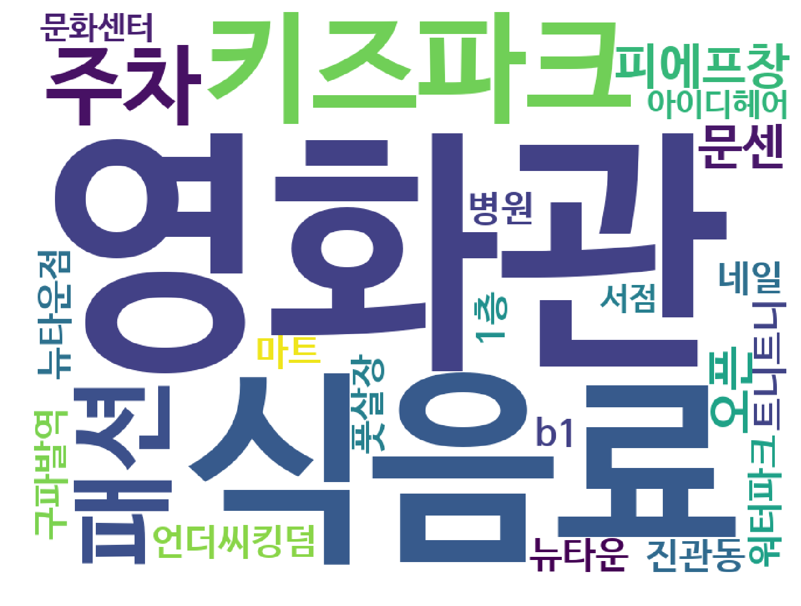
정답은 롯데몰 은평입니다!
> 엔터테인먼트 관련 태그가 가장 많이 등장한 복합쇼핑몰은 롯데몰 은평(#영화관), 스타필드 하남(#워터파크)입니다.

### **Q3. 이곳은 어디일까요? (Hint : 컴퓨터)**
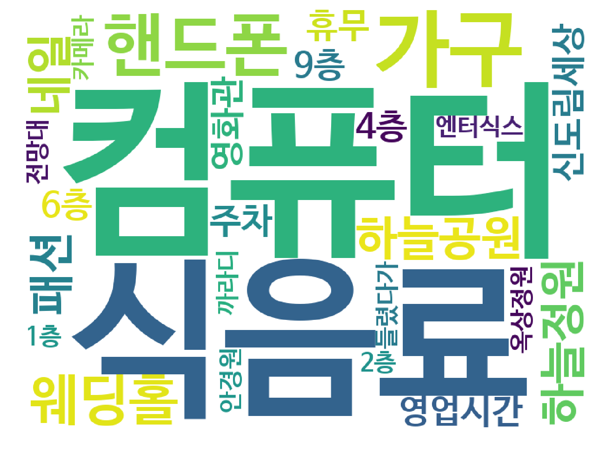
정답은 테크노마트입니다!
> 전자기기 관련 태그가 가장 많이 등장한 쇼핑몰은 테크노마트(#컴퓨터)입니다.

### **Q4. 이곳은 어디일까요? (Hint : 현대시티몰)**
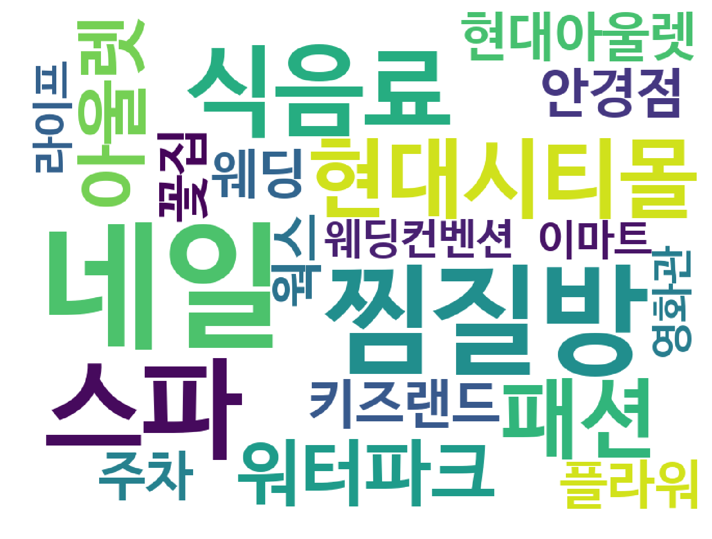
정답은 가든파이브입니다!
> 가든파이브는 다양한 태그가 비교적 고르게 분포하는 경향을 보이고 있습니다. (#찜질방, #네일, #현대시티몰)

[소스코드 보기 - by 김윤경](https://github.com/Yoonkimove/multiplex/blob/master/word%20cloud%20m3-F.ipynb)

## **Part 4. 디큐브 vs. 타임스퀘어, 당신의 선택은?**

> 나는 신도림과 영등포 사이에서 헤매고 있다. 집에 들어가긴 아쉽고 좀 놀고 싶다.
어딜 가야 할까?

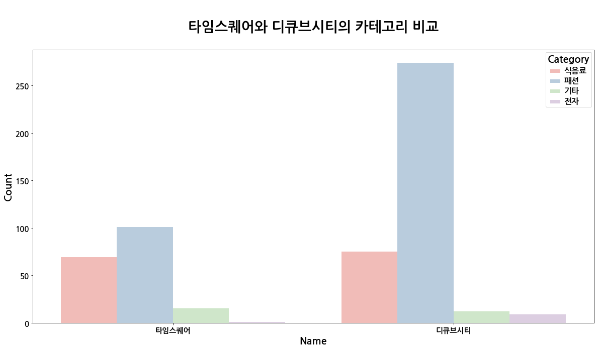

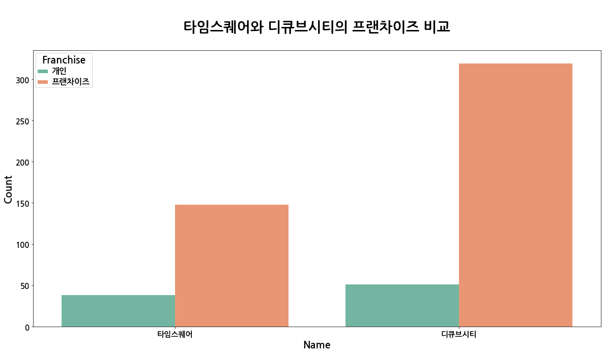

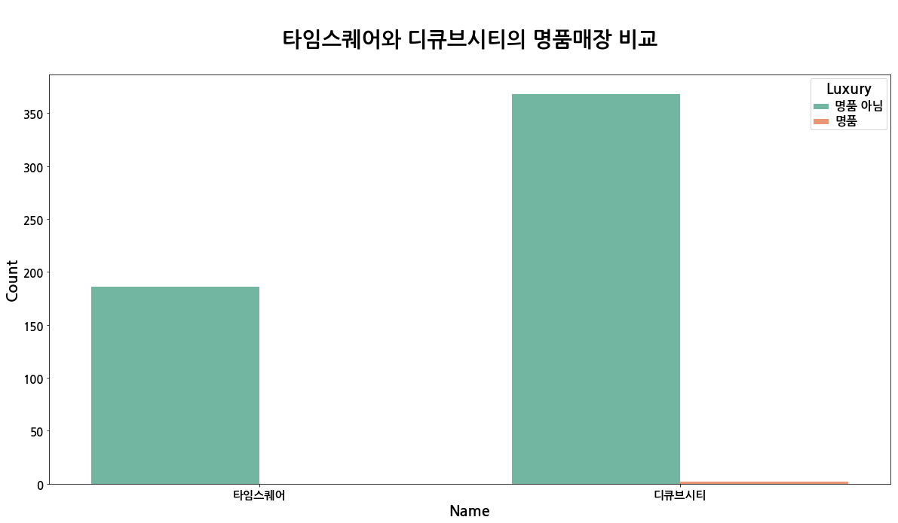

[소스코드 보기 - by 채송이](https://github.com/Yoonkimove/multiplex/blob/master/M3_mall_recommendation.ipynb)

## **마무리**
재밌게 보셨나요?

# **Credit**
시각화장인 김윤경
코딩장인 김지은
디자인장인 김진영
노가다장인 이은지
지도/차트장인 채송이

['멀티플렉스, 멀티라이프' 프로젝트 후기](http://oranjieunk.github.io/)
